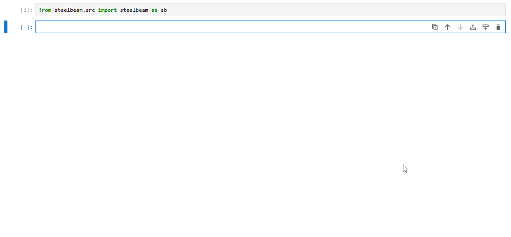

# steelbeam

A lightweight Python library for structural steel beam design and verification, with native LaTeX formula rendering and multi-code support (Eurocode, AISC, NBR).

## Installation

Install with:
```bash
pip install steelbeam
```

You can import with:

```python
import steelbeam as sb
```

## Why steelbeam?

- **Code-agnostic**: Switch between Eurocode, AISC, and NBR with a single parameter
- **Transparent calculations**: Every formula is rendered in LaTeX using `handcalcs` library — no black boxes
- **Jupyter-native**: Designed for interactive exploration in notebooks
- **Multi-definition of geometry**: Pre-defined databases or user definition (manual values or using `sectionproperties` library)
- **Ability to use units**: Use SI or Imperial units with the `pint` library implementation

## How it works

After importing the library, you must create an object representing the steel beam. 
You can select an existing standard profile from the provided databases (currently only European and American) or define a new profile with custom characteristics (manual entries or using the sectionproperties library's definition).

*Example with provided database*



## Docs

You can use the following documentation for initial understanding of library's capabilities:

[](https://deepwiki.com/RoccoRaimo/steelbeam)

## List of features

- Definition of geometry with **predefined databases** (European or American)
- Definition of geometry with **dxf import** (using sectionproperties library for FEM calculation of section properties)
- List of functions already implemented for national codes design formulas:
	- **Eurocodes**
		- Normal force tension resistance :heavy_check_mark:
		- Normal force compression resistance :heavy_check_mark:
		- Bending moment resistance for both axis of profile :heavy_check_mark:
		- Shear resistance for both axis of profile :heavy_check_mark:
		- Combined bending and axial force resistance :heavy_check_mark:
		- Combined bending and shear force resistance :x:
		- Torsion :x:
		- Euler buckling :heavy_check_mark:
		- Compression member buckling :heavy_check_mark:
		- Bending with Lateral-Torsional buckling :heavy_check_mark:
	- **AISC/AASHTO**
	 	- Normal force tension resistance :heavy_check_mark:
		- Normal force compression resistance :heavy_check_mark:
	- **NBR** (work in progress)
- Configurable **partial safety factors**
- All resistance functions support both calculation mode and **rendered output mode** using the handcalcs library
- Possibility to use **unit-aware** or **dimensionless** quantities using the pint library
  
## Dependencies

- `numpy` — numerical computations
- `handcalcs` — LaTeX formula rendering
- `pint` — unit handling
- `sectionproperties` (optional) — geometry section properties

## Changelog
See CHANGELOG.md for more information.

## Desktop Application (Coming Soon)

While `steelbeam` is designed for interactive use in Jupyter notebooks, my aim is to build also a **standalone desktop application** that lets you perform the same calculations without writing code.

- Point-and-click interface
- Export reports in PDF/LaTeX
- Works offline — no Jupyter required

> Stay tuned for the first beta release!
